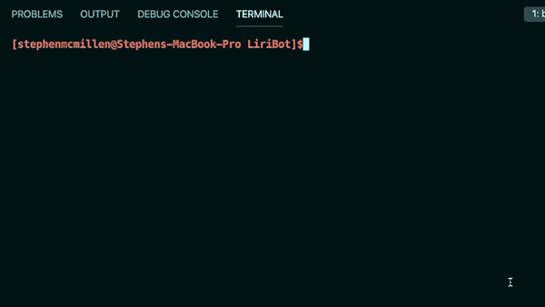
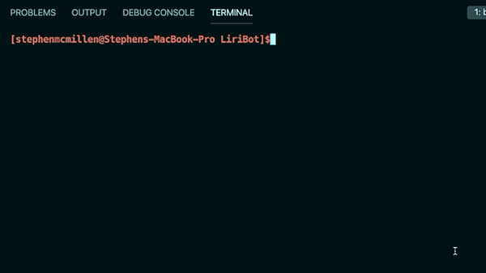
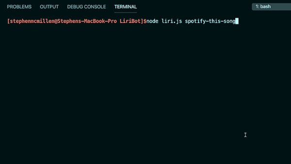
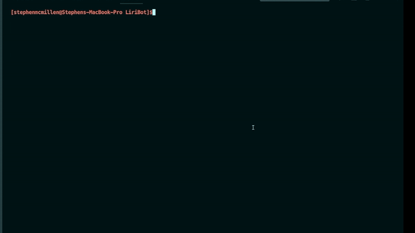
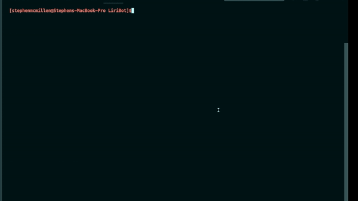
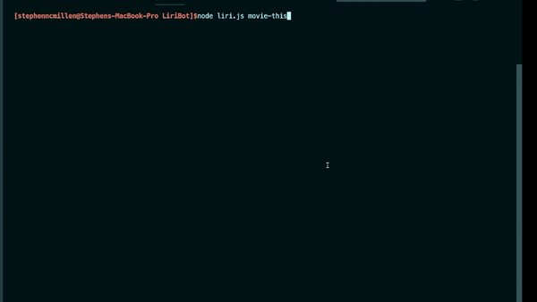
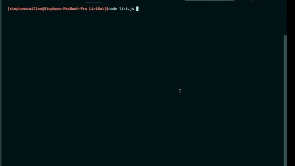

# LIRI BOT
## **Your new best artificial friend**

#### ***LIRI Bot User Manual***

Thank you for purchasing your ver own LIRI Bot! Count yourself among the tens of owners of the most advanced and helpful bot *if you're looking for specific information about concerts, songs, or movies.*

This LIRI Bot was handmade with care in our coding factory in Austin, Texas.

*Please be aware the following programming languages and class subjects were used in creating LIRI Bot.*

***IF YOU ARE ALLERGIC TO ANY OF THE FOLLOWING, PLEASE DISCONTINUE USE AND SEE A DOCTOR:***

- Javascript
- Node.js
- Node Arguments
- Switch Statements
- fs.readFile
- fs.appendFile
- ~~Inquirer Prompts~~ [*removed in beta*]
- Axios Module
- Moment Module
- Spotify Module
- .env files
- Bands In Town API
- OMDB API

## HOW CAN I USE MY LIRI BOT?
LIRI Bot was created to make your life easy! You can input commands into your terminal and let LIRI Bot do the rest!

LIRI Bot can give you information about a whole array of 3 subjects!
 - Spotify Songs
 - Concert information for a band or artist
 - Movie Information

 ## HOW CAN I GET MY LIRI BOT TO DO ALL THOSE AMAZING TASKS?
 All you need to do is enter commands in your terminal! Here's a list of commands you can enter:

 ## 1. **node liri.js**
 - *Displays instructions for LIRI Bot use*

 

 ## 2. **node liri.js spotify-this-song**
 - *Displays song information for Ace of Base - 'The Sign'*

 

 ## 3. **node liri.js spotify-this-song 'song title'**
 - *Displays song information for specified song*

  

 ## 4. **node liri.js concert-this 'artist'**
 - *Displays a list of concerts for specified artist* 
 
 

 ## 5. **node liri.js movie-this**
 - *Displays infromation for 'Mr. Nobody'* 
 
 

 ## 6. **node liri.js movie-this 'movie title'**
 - *Displays infromation for specified movie* 
 
 

 ## What if I don't want to type these commands over and over again?
Simply open the random.txt and fill in one of the commands you'll be using in the format:
- [command],'search term'

*(The example is 'I Want it That Way')*

Run **node liri.js do-what-it-says** in the terminal to run the command from the random.txt file!

 

###  Here's a  link to view a video of the developer using the LIRI Bot:
## [***Video Demo***](https://drive.google.com/file/d/15O6cB1r50-oq5Neu_qAgPJhlUQIVG2Fj/view?usp=sharing)

## You're ready to use your LIRI Bot!
### The world is yours! Good luck!
### Check log.txt for your search history! (or to clear it.....)
### Don't forget to try 'node doge.js' 
